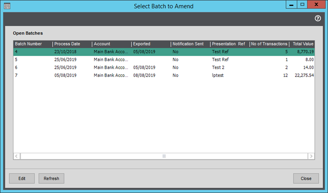

# Amending Batch Details

Using the Amend Batch Details form, the user can select a batch number from the grid and use the ‘Edit’ button on the form to amend the following details:

- Batch Number
- Batch Date
- Process Date
- Presentation Date
- Presentation Ref

