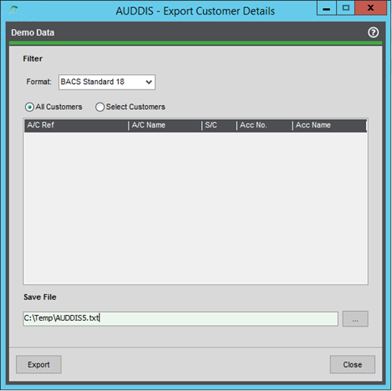
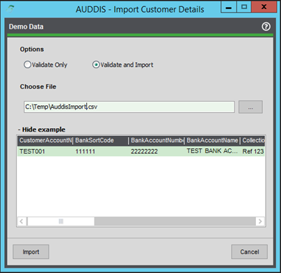

# Generating AUDDIS

### Export Customer Details

AUDDIS files are required by BACS when setting up a customer for direct debit collections. These can be generated from the Export Customer Details screen, as shown below. Once exported in the chosen format, these can then be forwarded to the bank for processing.

Any customer that has been flagged for direct debit collections but has not had instructions submitted will be selectable from this screen; once an instruction file has been generated, the account will be flagged as submitted. This is a soft lock on the customer account screen (see direct debit tab) and can be overridden if needed. That way, a file can be reproduced if needed.

Cancellation instructions can be generated from the customer account screen as well.

### Import Customer Details

The below screen can be used by the user to quickly import Direct Debit details for multiple customers at once. An example of the format required by the import file is shown below.
Once imported the customer/s is flagged to enable collections and is ready to go.

> **ℹ️ Note:** Any problems with the import file will be displayed on a new screen after validation.

