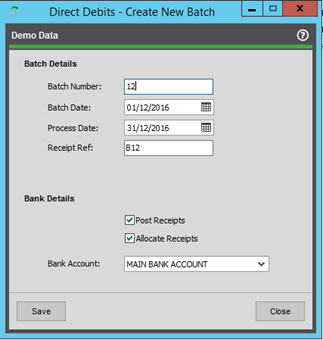
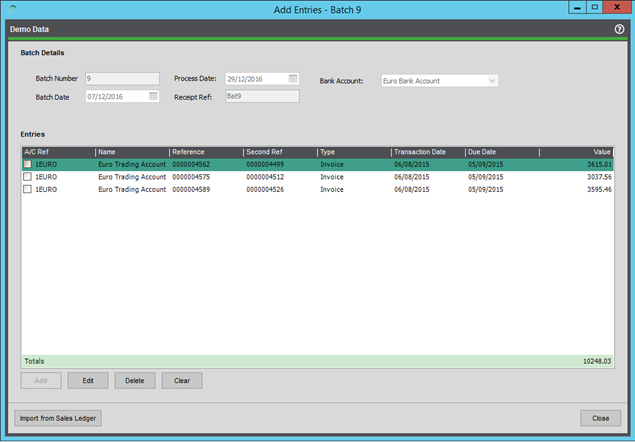
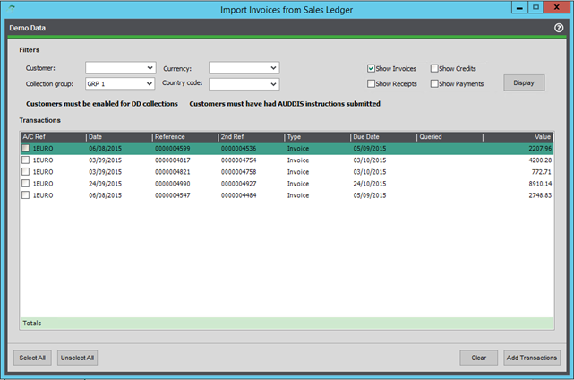

# Maintaining Batches

### Creating Batches

When creating a batch, the user will be presented with the below screen. Certain fields are required and can be amended when needed, assuming the batch has not been processed already. Historical batches can be viewed in read-only mode if required.  
Should the user require a batch to be deleted, the menu option can be used to do this.   
> **⚠️ Warning:** Once deleted, there can be no reversal. All information and entries related to that batch will be removed.

**Batch Number:** *Required* - The identifying ‘number’ for this batch can be automatically generated or manually entered.  
**Batch Date:** *Required* - The date the batch was entered into the system.  
**Process Date:** *Required* - The processing date for this batch. Transactions are only valid for use in this batch if the transaction due date is prior to the processing date.    
**Receipt Ref:** Used as the Transaction Reference when posting a completed batch to the Sales Ledger.  
**Bank Account:** *Required* - The bank account selected for this batch Used when filtering transactions.  

### Amending and Viewing Transactions

Once a batch has been created and the details populated, the user can then begin adding transactions to the batch. The screen below will show details of all transactions linked to the selected batch.

The user has the ability to add or remove entries from the batch. Transactions included in the batch can also be amended should the user wish to collect a portion of the value now and then the remaining value at a later date or part of a later batch.

Batches can be amended up to the point of processing. However, the user must ensure they remember to export or update notification emails afterwards.

Manual ‘Ad-hoc’ Transactions can also be included as part of a batch, and if the user has the Scheduled Payments Plugin, those will also show on the below screen.

The Import from Sales Ledger button will direct the user to the filtering screen, as detailed below.

>**ℹ️ Note:** A batch can include multiple customers; however, they must share the same bank account or currency as the batch.

>**ℹ️ Note:** Transactions can only be part of a single batch.

>**ℹ️ Note:** Manual transactions are not linked to anything in Sage.

### Filtering Transactions

Here you will be presented with several filters that can be used to easily find the relevant transactions you need, i.e., for a specific customer or collection group.

The option to include various transaction types is by default set to allow invoices only; however, other transaction types can be included in a batch.

Once you have selected your chosen filters, hitting display will present you with a list of all valid transactions that can be added to that batch. There are several criteria that determine this, such as:
- Is the account enabled for collections?
- Is the transaction already included in another batch? If so, hide it.
- Is the due date on the transaction before or equal to the process date on the batch?
- Is the transaction unallocated?
- Has the transaction queried flag been set? If so, hide it.

Once that process is over, you can add the chosen transactions to a batch, either by selecting all or individual transactions and then clicking Add Transactions.

>**ℹ️ Note:** You cannot add transactions that are not of the same currency, nor can you add transactions that cause the total for that customer to go below zero.

Transactions can be removed if needed, freeing them up for selection for another batch.

