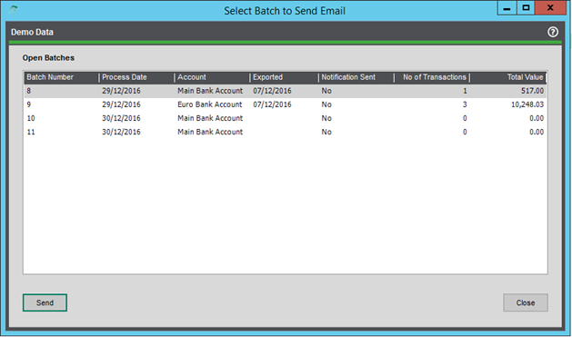
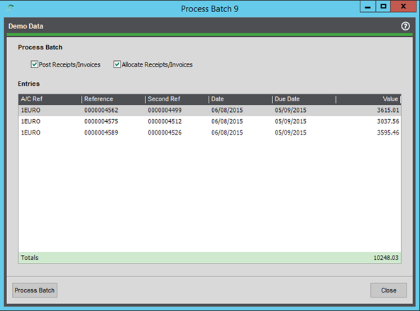

# Processing Batches

### Send notification emails

Before you process a batch, you will have to send the relevant notification emails out to indicate to the customer that the total value of transactions for that customer will be taken out of their account on the indicated date, in this case, the process date. The grace period for these notifications will vary, but is usually around 10 days.

This will send out a simple HTML-formatted email to any customer in that batch that has been enabled to allow notification emails to be sent and has the relevant contact role or email added. Those customers that do not have an email address enabled will have the option to instead be printed off as a collection letter report at the end of the process.

Once notification emails have been sent, you will be shown a report summarizing the batch and its totals. This can be saved or printed out if needed for later reference.

> **ℹ️ NOTE:** The SMTP settings will need to be correctly configured before you can send notification emails; the sender address will also need to be set; it is read from Company Contact Details under Accounting System Manager > Settings > Company Details.

> **ℹ️ NOTE:** Emails can be customized on request.

### Exporting the batch

Once you are ready to begin processing the batch, you will first need to export the batch as the relevant output file using the below screen.

Here, you will be presented with the details of the batch contents. Click Browse and specify the name of the output file and the location to save to, and the rest will be done automatically. The output file format is specified by the collection bank’s output format, which is set on the Amend Account screen.

Once generated, the file is typically processed through some form of transmission software, such as ALBANY, or handed to the bank. Most banks have their own software or process to handle this.

**Current formats supported include:**
- SEPA (XML)
- Danske (CSV)
- BACS Standard 18 (TXT)
- Default (CSV)

> **ℹ️ NOTE:** Further formats can be developed on request.

### Processing the batch

Once you have sent notification emails out and exported the batch and it has been processed by the bank, you will want to come back and close the batch off in Sage. This can be done using the below screen.

Processing a batch will post and allocate a batch receipt and allocate off the individual transactions that are a part of that batch. If you need to, you can post the batch receipt first, then allocate it at a later date.

> **ℹ️ NOTE:** The receipt reference on the batch will be the transaction reference, and the process date will be the transaction date when posted.

Once everything is allocated, the batch will be flagged as closed and will no longer be amendable.

