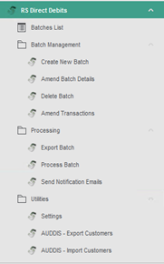
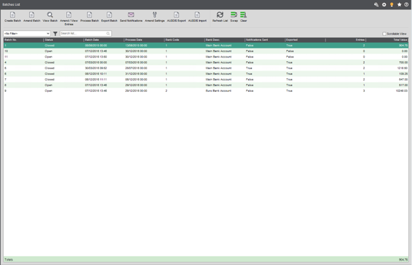
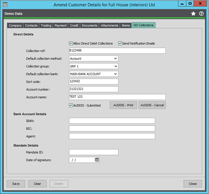
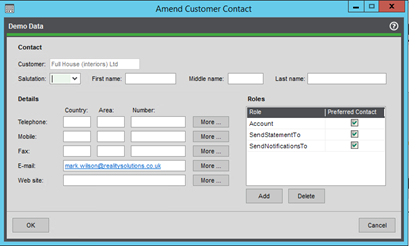
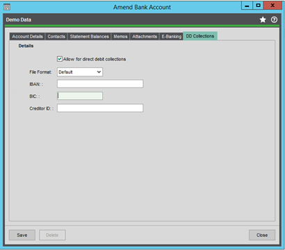
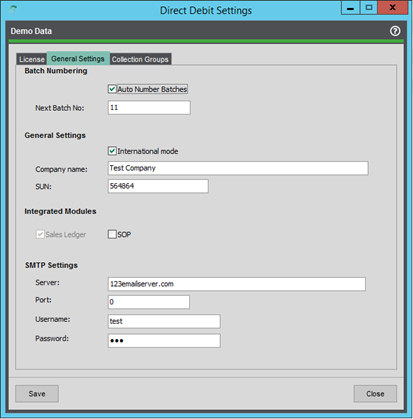

# Setup and Menus

### Sage 200 Menu

### Main Desktop List
**Create New Batch**: Screen to create or set up the details of a new batch.  
**Amend Batch Details**: Screen to amend details for an existing batch.  
**Delete**: Screen to allow the user to select and delete a batch from the system.  
**Amend Transactions**: Screen to allow users to maintain transactions included within a batch.  
**Export Batch** Screen to select and export a batch to a selected file format or location.  
**Process Batch**: Screen to select a batch and post or allocate receipts to the sales ledger.  
**Send Notification Emails**: Screen to allow users to send notification emails for a selected batch.  
**Settings**: Screen to maintain various settings for the Direct Debits Module.  
**AUDDIS**—Export Customers—Screen to allow users to create AUDDIS Instructions files for new customers requiring setup with BACS.  
**AUDDIS**: Import Customers: Screen to allow users to quickly flag and import direct debit information for customers via CSV import.  

### Screens Modifided

#### Amend Customer Details (Sales Ledger)

**Send Notification:** Used to specify if a notification email will be sent to the customer; if not checked, nothing will be sent; if checked, see the screenshot below.  
**Collection Ref:** Needed for the output file.  
**Collection Method:** Not currently in use; leave as direct debit.  
**Collection Group:** Used to group customers for filtering transactions to add to a batch.  
**Collection Bank:** Must be populated; required when filtering transactions.  
**Sort Code/Acc No/Acc Name:** Needed for the output file.  
**IBAN, BIC, Agent:** Needed for the output file. (International Mode)  
**Mandate Details / Debtor ID:** Needed for the output file. (International Mode)  
**AUDDIS Print / Cancel:** Can be used to generate instruction files for BACS (new customers or cancelling customers).  

**SendNotificationsTo**: If the Send Notification Emails option is checked, then the relevant contact will need this role added with the correct email address. This will be used when sending notification emails.

#### Amend Bank Account (Cash Book)

**File Format:** Used to specify which output file is used when exporting a batch.
1. Default: CSV/BACS Std18 Format for BACS
2. Deutsche: SEPA Format for Deutsche Bank
3. Danske: CSV Format for Danske Bank

**IBAN, BIC, Creditor ID:** needed for the output file (international mode)

### Settings

**Batch Numbering:** Toggle auto-generation of batch numbers.  
**General Settings:** International Mode will toggle extra controls on the SL account screen. Company/SUN will be needed for output files.  
**Integrated Modules:** SL by default; SOP option should the customer require bespoke integration with the SOP module.  
**SMTP Settings:** Needed for notification emails to work.  
**Collection Groups:** Maintaining collection groups here can be used to make filtering transactions easier and allow more control over batches.  
**License:** Display license information, days remaining, etc.  

